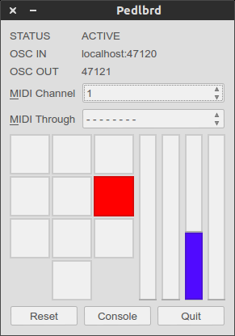
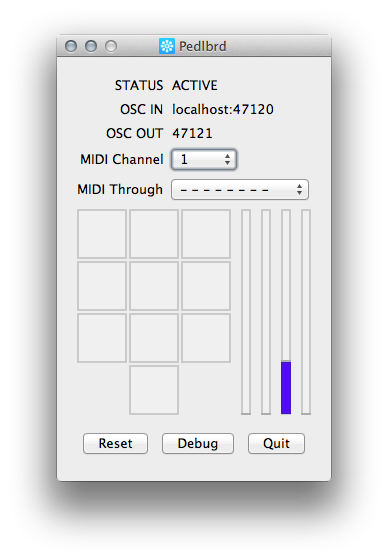

![icon]

# PEDLBRD

An Arduino based sensor interface.

## Features

* connect all kinds of MIDI pedals (expression, switch, volume)
* connect resistive sensors (force, light, any potentiometer)
* autocalibration for both analog and digital (switch polarity)
* autonormalization: no need to configure range
* MIDI output 
* OSC output
* plug-and-play
* highly configurable if you need
* driver works in all three major platforms: OSX, Linux and Windows
* Tested with OSX 10.6.8, 10.8 and 10.9, Ubuntu 12.04 and 13.10, Windows 7

## Install

* Go to [Downloads] and get the package for your platform. 
* Extract the app, open it.
* Connect the device. 

## Build Dependencies

* python >= 2.7
* Qt 4.7
* PySide
* liblo, pyliblo
* rtmidi2
* timer2
* Cython
* notifydict
* virtualenv

## Build Steps

1. Create a virtualenv in python
2. Install all your dependencies
3. Test first: go to the root folder and launch pedlbrd.py
4. Create the app by launching

    * OSX: make-app-osx
    * Linux: make-app-linux
    * Windows: python make-app-windows.py

## Usage
TODO

## OSC API

By default, the device sends data to the port 47121 on the localhost.

The OSC API is documented [here][oscapi]

For more information on the OSC API, see pedlbrd/protocols.txt

[icon]: assets/pedlbrd-icon-128.png "Pedlbrd" style="margin-left:auto; margin-right:auto"
[oscapi]: pedlbrd/protocols.md
[Downloads]: https://github.com/gesellkammer/pedlbrd/tree/master/binaries